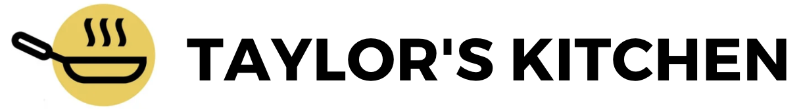

<!-- Improved compatibility of back to top link: See: https://github.com/othneildrew/Best-README-Template/pull/73 -->

<!--
*** Thanks for checking out the Best-README-Template. If you have a suggestion
*** that would make this better, please fork the repo and create a pull request
*** or simply open an issue with the tag "enhancement".
*** Don't forget to give the project a star!
*** Thanks again! Now go create something AMAZING! :D
-->

<!-- PROJECT SHIELDS -->
<!--
*** I'm using markdown "reference style" links for readability.
*** Reference links are enclosed in brackets [ ] instead of parentheses ( ).
*** See the bottom of this document for the declaration of the reference variables
*** for contributors-url, forks-url, etc. This is an optional, concise syntax you may use.
*** https://www.markdownguide.org/basic-syntax/#reference-style-links
-->

[![Contributors][contributors-shield]][contributors-url]
[![Forks][forks-shield]][forks-url]
[![Stargazers][stars-shield]][stars-url]
[![Issues][issues-shield]][issues-url]
[![MIT License][license-shield]][license-url]
[![LinkedIn][linkedin-shield]][linkedin-url]

<!-- PROJECT LOGO -->
 

  

<h3 align="center">Group Project 1</h3>

  

    A simple meal plan generator based on your diet and needs.
     
    <a href="https://github.com/isayahdurst/group-project-1"><strong>Explore the docs »</strong></a>
     
     
    <a href="https://github.com/isayahdurst/group-project-1">View Demo</a>
    ·
    <a href="https://github.com/isayahdurst/group-project-1/issues">Report Bug</a>
    ·
    <a href="https://github.com/isayahdurst/group-project-1/issues">Request Feature</a>
  

<!-- TABLE OF CONTENTS -->

  
Table of Contents

  <ol>
    <li>
      <a href="#about-the-project">About The Project</a>
      <ul>
        <li><a href="#built-with">Built With</a></li>
      </ul>
    </li>
    <li><a href="#usage">Usage</a></li>
    <li><a href="#roadmap">Roadmap</a></li>
    <li><a href="#contributing">Contributing</a></li>
    <li><a href="#license">License</a></li>
    <li><a href="#contact">Contact</a></li>
    <li><a href="#acknowledgments">Acknowledgments</a></li>
  </ol>

<!-- ABOUT THE PROJECT -->

## About The Project

[![Taylor's Kitchen][product-screenshot]](https://example.com)

Of all the questions that have ever been asked, one of the oldest and most important must be: "What should I eat today?" For most of human history, people didn't really have much of a choice; they ate what was available to them. But in the modern era that we live in today, we do have a choice of what we eat, and those choices can make a drastic difference on our long-term health.

But bodies are different, and different bodies require different diets. There isn't a "one-size-fits-all" plan for personal nutrition.

<b>We've created the next best thing:</b> a meal plan that's tailored to your specific diet preferences. Our website allows you to customize your diets, cuisines, and food intolerances to your liking to recommend foods and recipes that compliment your tastes and needs.

This application has been built using two different server-side APIs and is a complete front-end solution. Without having access to a back-end, we've leveraged local-storage and third-party data storage solutions to bring this project to life and create something that we found to be challenging, exciting, and useful.

The main contributors to this project are listed as follows:

- Anthony Li
- Frank Nguyen
- Raymond Robinson
- Benjamin Ha
- Isayah Durst

(<a href="#readme-top">back to top</a>)

### Built With

- 
- 
- 
- 

(<a href="#readme-top">back to top</a>)

<!-- GETTING STARTED -->

## Usage

Customize food plan based on:

- Diets
- Cuisines
- Intolerances
- Ingredients (coming soon)

(<a href="#readme-top">back to top</a>)

<!-- ROADMAP -->

## Roadmap

- [ ] Allow users to target a specific number of daily calories they would like to consume and tailor their meal plan accordingly.
- [ ] Allow users to search for ingredients they would like to have in their meals or ingredients they would specifically like to exclude.
- [ ] Allow users to add ingredients to a shopping cart and open that shopping card with a grocery delivery service for easy ordering.
  - [ ] Users can edit their pantry to check which items they already have and which items they need to buy.

See the [open issues](https://github.com/isayahdurst/group-project-1/issues) for a full list of proposed features (and known issues).

(<a href="#readme-top">back to top</a>)

<!-- CONTRIBUTING -->

## Contributing

Contributions are what make the open source community such an amazing place to learn, inspire, and create. Any contributions you make are **greatly appreciated**.

If you have a suggestion that would make this better, please fork the repo and create a pull request. You can also simply open an issue with the tag "enhancement".
Don't forget to give the project a star! Thanks again!

1. Fork the Project
2. Create your Feature Branch (`git checkout -b feature/AmazingFeature`)
3. Commit your Changes (`git commit -m 'Add some AmazingFeature'`)
4. Push to the Branch (`git push origin feature/AmazingFeature`)
5. Open a Pull Request

(<a href="#readme-top">back to top</a>)

<!-- LICENSE -->

## License

Distributed under the MIT License. See `LICENSE.txt` for more information.

(<a href="#readme-top">back to top</a>)

<!-- CONTACT -->

## Contact

Isayah Durst - [@isayahdurst](https://twitter.com/isayahdurst) - isayah@fungeapp.com

Project Link: [https://github.com/isayahdurst/group-project-1](https://github.com/isayahdurst/group-project-1)

(<a href="#readme-top">back to top</a>)

<!-- ACKNOWLEDGMENTS -->

## Acknowledgments

- [othneildrew](https://github.com/othneildrew/Best-README-Template/blob/master/BLANK_README.md)
- [Spoonacular Docs](https://spoonacular.com/food-api/docs)
- [MDN Web Docs](https://developer.mozilla.org/en-US/docs/Web/API/Event/stopPropagation)
- [Stackoverflow.com](https://stackoverflow.com/questions/1223354/undo-git-pull-how-to-bring-repos-to-old-state)
- [Shields.io](https://shields.io/)

(<a href="#readme-top">back to top</a>)

<!-- MARKDOWN LINKS & IMAGES -->
<!-- https://www.markdownguide.org/basic-syntax/#reference-style-links -->

[contributors-shield]: https://img.shields.io/github/contributors/isayahdurst/group-project-1.svg?style=for-the-badge
[contributors-url]: https://github.com/isayahdurst/group-project-1/graphs/contributors
[forks-shield]: https://img.shields.io/github/forks/isayahdurst/group-project-1.svg?style=for-the-badge
[forks-url]: https://github.com/isayahdurst/group-project-1/network/members
[stars-shield]: https://img.shields.io/github/stars/isayahdurst/group-project-1.svg?style=for-the-badge
[stars-url]: https://github.com/isayahdurst/group-project-1/stargazers
[issues-shield]: https://img.shields.io/github/issues/isayahdurst/group-project-1.svg?style=for-the-badge
[issues-url]: https://github.com/isayahdurst/group-project-1/issues
[license-shield]: https://img.shields.io/github/license/isayahdurst/group-project-1.svg?style=for-the-badge
[license-url]: https://github.com/isayahdurst/group-project-1/blob/main/LICENSE.txt
[linkedin-shield]: https://img.shields.io/badge/-LinkedIn-black.svg?style=for-the-badge&logo=linkedin&colorB=555
[linkedin-url]: https://linkedin.com/in/isayah-durst-3b0395244
[product-screenshot]: ./assets/images/main.JPG
